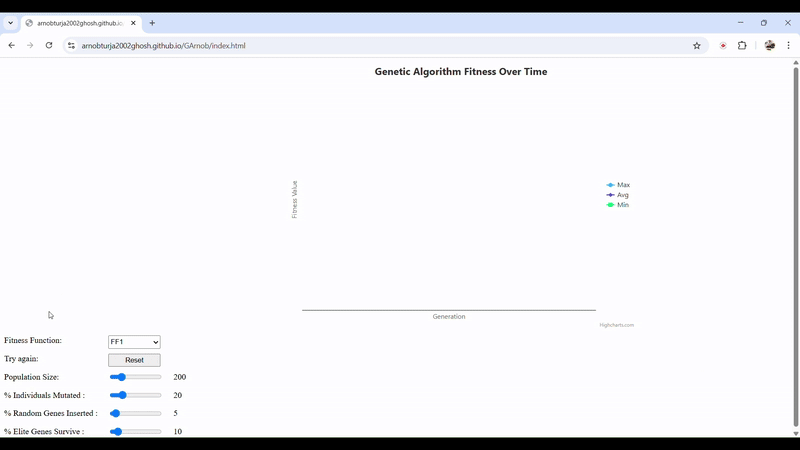

I go by the pronouns he/him.

My website: https://arnobturja2002ghosh.github.io/

A few of my projects:
- [openCVChArUco](https://github.com/ArnobTurja2002Ghosh/openCVChArUco)
  - Python project
  - Marker-based computer vision with OpenCV ArUco module
  - [Project Page](https://ArnobTurja2002Ghosh.github.io/openCVChArUco/web)
- [Travel Planner App](https://github.com/mohdalibn/travel-planner-app/)
  - Created using Flutter
  - Collaborators: [Arnob](https://github.com/ArnobTurja2002Ghosh/ArnobTurja2002Ghosh), [Ali](https://github.com/mohdalibn/), [Arunav](https://github.com/ARNAB814) and [Libin](https://github.com/XxCaleb-CalebxX)
  - Private repository. Please contact any of the collaborators for access.
- [f1](https://github.com/ArnobTurja2002Ghosh/f1)
  - Created using Flutter
  - Private repository. Please contact me for access.
  - Consists of a list of small discrete projects I was building while learning Flutter
- [react-mern--introduction-to-react-router](https://github.com/ArnobTurja2002Ghosh/react-mern-batch-3-class-7-introduction-to-react-router)
  - Created using React
  - Visit [this link](https://iridescent-pavlova-20c187.netlify.app/) where the project is being hosted, to get a quick idea about the project, instead of reading my wordy descriptions.
- [JavaSwing1](https://github.com/ArnobTurja2002Ghosh/JavaSwing1)
  - Created using Java
  - Project that allows you to paint a grid with shapes of different colors
  - Further information (with illustrating images) about the project is in the README of the repository
- [Chomp](https://github.com/ArnobTurja2002Ghosh/Chomp)
  - Created using Java
  - Instructions like how to run the program is provided in Instructions.txt in the repository
  - Play the game of Chomp against the randomness of computer
  - The game contains GUIs. Infact the whole game is made with GUIs.
- [ProjectAI](https://github.com/ArnobTurja2002Ghosh/ProjectAI)
  - Developed with Threejs (Javascript) in collaboration with [Zawadul](https://github.com/zawadman). We informally named the game in this project - FishFrenz.
  - The game does not contain any GUI: when the game ends, the program crashes, but you can restart the game by simply reloading the browser where you are playing.
  - FishFrenz story: It is a snowy night. Your enemy - the crocodile - is trying to eat your fish friends. The fish are capricious; they take erratic turns in every frame; you can never be sure which direction a fish will be travelling. The voracious enemy targets one of the fish in the water. The truculent crocodile will breach the border of the territory of fish because the direction of the targetted fish is the catalyst that gives the enemy its direction of motion. The enemy thinks that because it is hard to see in snow, let alone at night, it cannot get shot by you, so it will succeed. Only your winning can disabuse the crocodile.
  - [Video documentation](https://youtu.be/jSKkR0WAcm0?si=PtDyGDDQl_MoiSQ-)
  - [Play FishFrenz](https://zawadman.github.io/fishFrenz/)
- [Bouncing Shapes](https://github.com/ArnobTurja2002Ghosh/BouncingShapes) - my first C++ project
  - inspired from a Youtube tutorial. Link of the tutorial is in the README of the repository.
- [Catalina430](https://github.com/ArnobTurja2002Ghosh/Catalina430)
  - A C++ project. 
  - Modification of Geometry Wars by the Github user [Catalina430](https://github.com/Catalina430)
